# PES-VCS Implementation

## Student Details

* Name: Adil Ahmed
* SRN: PES2UG24AM013

---

## Phase 1: Object Storage

### Description

Implemented content-addressable object storage using SHA-256 hashing. Objects are stored in `.pes/objects` using directory sharding. This ensures that identical files are stored only once, enabling deduplication and efficient storage.

### Screenshot 1A

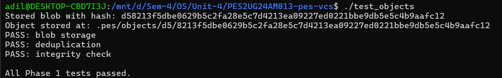

### Screenshot 1B

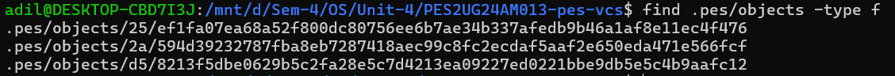

---

## Phase 2: Tree Objects

### Description

Implemented tree serialization and parsing. Tree objects represent directory structures by storing references to blobs and subtrees. This allows reconstruction of complete project states at any point in time.

### Screenshot 2A

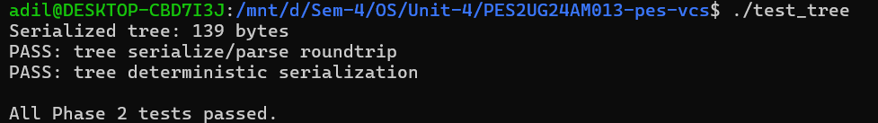

### Screenshot 2B

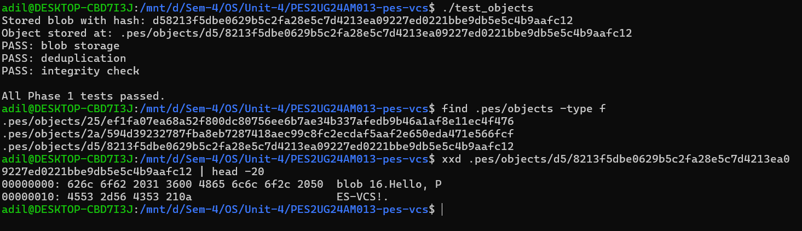

---

## Phase 3: Index (Staging Area)

### Description

Implemented a staging area using a text-based index file. The index tracks file metadata including mode, hash, modification time, and size. Supports adding files, saving index atomically, and checking repository status.

### Screenshot 3A

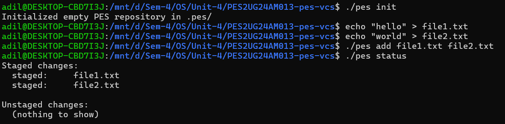

### Screenshot 3B

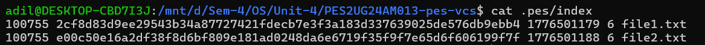

---

## Phase 4: Commit Objects

### Description

Implemented commit creation by linking tree objects with commit metadata and messages. Each commit references a parent commit, forming a history chain. The HEAD pointer and branch references are updated to track the latest commit, enabling log traversal and history inspection.

### Screenshot 4A (Commit Log)

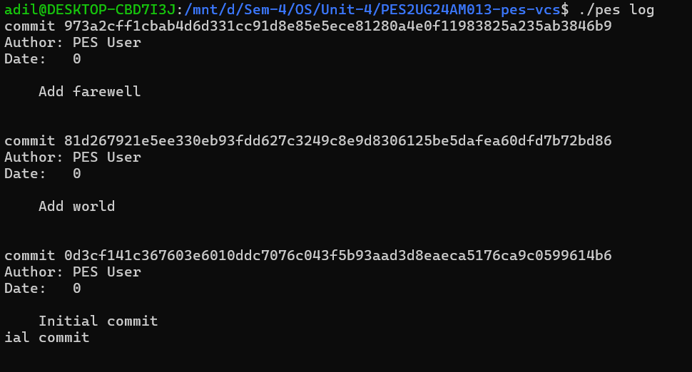

### Screenshot 4B (Repository Structure)

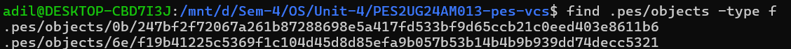

### Screenshot 4C (HEAD and Branch Reference)

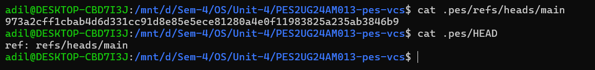

---

## Final Integration Test

### Description

Executed the full integration test to verify correct interaction between all components including object storage, trees, index, and commits.

### Screenshot FINAL-A

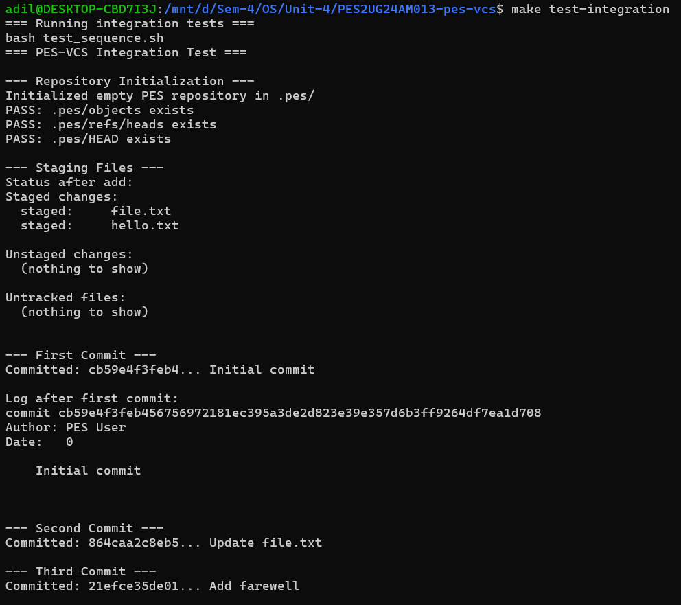

### Screenshot FINAL-B

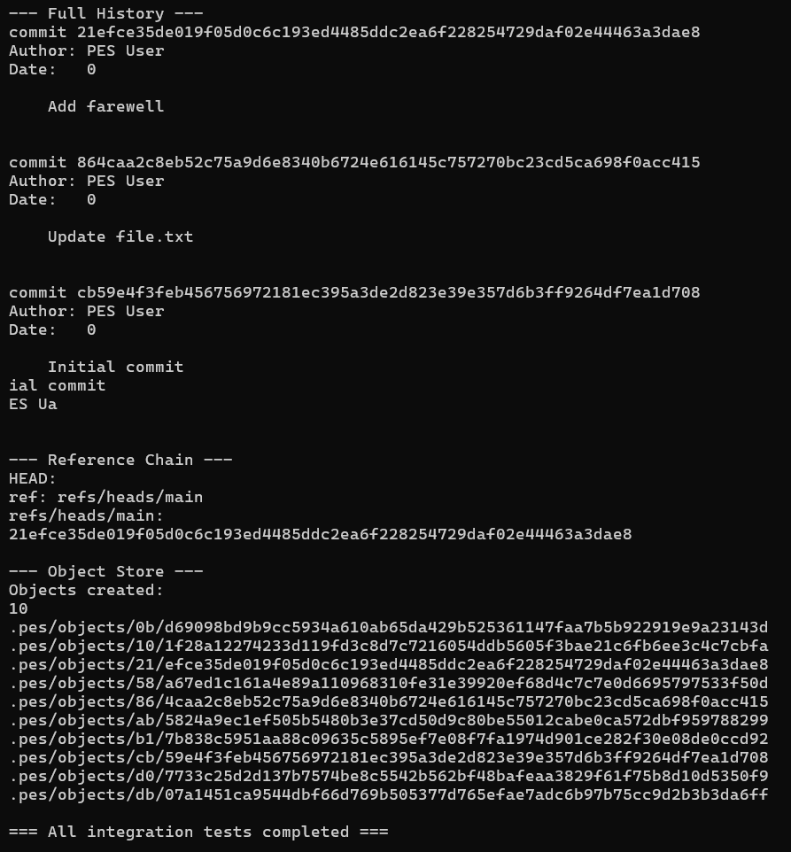

---

## Phase 5: Analysis

### Q5.1 — How does content-addressable storage work?

Content-addressable storage identifies data using a hash of its contents rather than its location. In this system, each file is hashed using SHA-256, and the resulting hash determines the file's storage path. This ensures that identical files produce the same hash and are stored only once, enabling deduplication.

---

### Q5.2 — Why use tree objects?

Tree objects represent directory structures by storing references to blobs (files) and other trees (subdirectories). This allows the system to capture the complete state of a project at a given point, enabling versioning of entire directory hierarchies.

---

### Q5.3 — How are commits linked?

Each commit stores a reference to its parent commit. This creates a chain of commits forming a history. By following parent links, the system can traverse back through previous versions, enabling features like logs and history tracking.

---

## Phase 6: Reflection

### Q6.1 — Challenges faced

One of the main challenges was handling memory correctly, especially when working with large structures like the index. Debugging segmentation faults and ensuring correct pointer usage required careful attention. Another challenge was ensuring proper interaction between components such as the index, tree, and commit systems.

---

### Q6.2 — Improvements

The system can be improved by adding features such as branching, merging, and better error handling. Additionally, implementing compression for stored objects and optimizing file operations would make the system more efficient and closer to real-world version control systems like Git.

---

## Conclusion

Successfully implemented a simplified version control system with object storage, tree structures, staging area, commit history, and full integration testing.